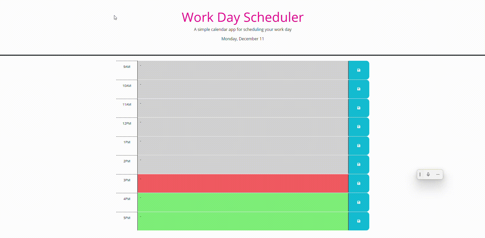

# Third-Party APIs: Work Day Scheduler
This calendar application allows a user to save events for each hour of a working day from 9am to 5pm. This app is run in the browser and features a dynamically updated HTML and CSS powered by Jquery code. using the day.js library.

## Table of contents
- [Features](#features)
- [Screenshots](#screenshots)
- [Usage](#usage)
- [Contributing](#contributing)
- [License](#license)

## Features
This calendar application allows a user to save events for each hour of a working day from 9am to 5pm. This app is. run in the browser and feature. and features a dynamically updated HTML and CSS powered by Jquery code. using the JS library.

## Screenshots
 (https://aliahg97.github.io/Workday-Planner/)

## Usage 
For employees with busy schedules who want to add important events to their daily planner, this will help them manage their time effectively.

git clone https://github.com/AliahG97/Workday-Planner.git

## Contributing
Add Notifications every hour  only when there is a task to be done.

## License
Creative Common license
© 2023 Aliah Guerra. Confidential and Proprietary. All Rights Reserved.